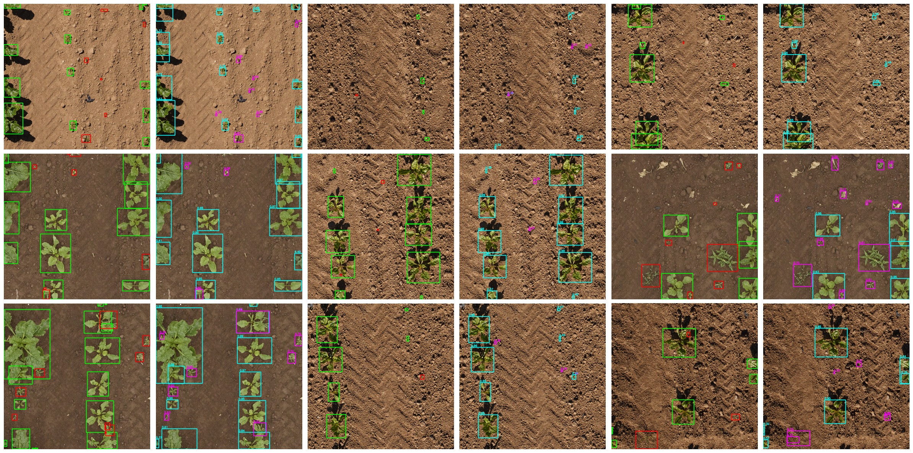

# mmdetection PhenoBench Plants Detection using EfficientDet

## 🌱🍀 PhenoBench Dataset 

[](https://www.python.org)
[](https://pytorch.org)


This repository contains a object detection project focused on **interpretation in the agricultural domain** across **2 categories** using **EfficientDet**.

---

## 🧭 Dataset Overview

The final dataset includes the following 2 classes for object detection, originally instance annotations:

| Class ID | Class Name             |
|--------- | ---------------------- |
| 0        | crop + partial-crop    |
| 1        | weed + partial-weed    |

Total train images: 1,407 / Total val images: 772

✅ Already instance masks for crop and weed for training and validation.  
✅ Converted semantic to instance for partial-crop and partial-weed for final combined dataset.

---

## 🏗️ Model Architecture

- 💎 Model: **EfficientDet**
- 💎 Weight: **"effb3"**
- 💎 Framework: **PyTorch + mmdetection**
- 💎 Input Size: **896, 896**
- 💎 Trained Epochs: **20**

---

## 📊 Final Performance
```
Average Precision  (AP) @[ IoU=0.50:0.95 | area=   all | maxDets=100 ] = 0.495
 Average Precision  (AP) @[ IoU=0.50      | area=   all | maxDets=1000 ] = 0.664
 Average Precision  (AP) @[ IoU=0.75      | area=   all | maxDets=1000 ] = 0.525
 Average Precision  (AP) @[ IoU=0.50:0.95 | area= small | maxDets=1000 ] = 0.210
 Average Precision  (AP) @[ IoU=0.50:0.95 | area=medium | maxDets=1000 ] = 0.576
 Average Precision  (AP) @[ IoU=0.50:0.95 | area= large | maxDets=1000 ] = 0.785
 Average Recall     (AR) @[ IoU=0.50:0.95 | area=   all | maxDets=100 ] = 0.584
 Average Recall     (AR) @[ IoU=0.50:0.95 | area=   all | maxDets=300 ] = 0.584
 Average Recall     (AR) @[ IoU=0.50:0.95 | area=   all | maxDets=1000 ] = 0.584
 Average Recall     (AR) @[ IoU=0.50:0.95 | area= small | maxDets=1000 ] = 0.332
 Average Recall     (AR) @[ IoU=0.50:0.95 | area=medium | maxDets=1000 ] = 0.687
 Average Recall     (AR) @[ IoU=0.50:0.95 | area= large | maxDets=1000 ] = 0.860
```

### 📈 Per-Class Evaluation Metrics:
```
+----------+-------+--------+--------+-------+-------+-------+
| category | mAP   | mAP_50 | mAP_75 | mAP_s | mAP_m | mAP_l |
+----------+-------+--------+--------+-------+-------+-------+
| crop     | 0.624 | 0.771  | 0.657  | 0.265 | 0.581 | 0.875 |
| weed     | 0.366 | 0.558  | 0.393  | 0.155 | 0.572 | 0.695 |
+----------+-------+--------+--------+-------+-------+-------+
```

---

## 🎨 Visualization Samples

The model outputs of **validation set** are visualized:

📌 Example of val:
  

---

## 🚀 How to Run Inference
```python
!python mmdetection/tools/test.py \
  mmdetection/projects/EfficientDet/configs/efficientdet_pheno.py \
  mmdetection/mmdet_outputs/efficientdet_crop_weed/best_coco_bbox_mAP_epoch_18.pth \
  --out result.pkl
```

---

## 🔑 Summary

✅ Applied mostly default configs  
✅ Implemented minimally  
✅ **Note** Really quite good results.

---

## 📄 License

This project is intended for **academic research and educational use** only. Please cite **original dataset paper** or **appropriately to this repo** if used in publications.

---

## ⭐ Acknowledgements

- EfficientDet powered by `mmdetection`
- Based on Popular instance segmentation benchmarking dataset `PhenoBench`

---
